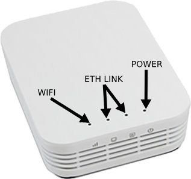

# What is Radio?

Radio is a wireless communication device that allows your computer to wireless interact with the RoboRio.
During competitions or deployment of code, you will be doing it through the Radio.

Here is what a radio looks like

## Ports
The FRC Radio has 3 ports on the back

### Port 1: Power
This port is used to send power to the Radio, also known as the **Power Port**.
### Port 2: Ethernet 1
This an Ethernet port is used to connect your radio to your RoboRio (or your computer during [Radio Configuration](/docs/system-setup/radio_config)). Also knows as **Ethernet Port 1**.
### Port 3: Ethernet 2
This an Ethernet port is used to connect your devices through an ethernet cable. I.e Network Switch, Limelight, Camera, etc.
Also knows as **Ethernet Port 2**.

:::note

If your using PoE (Power over Ethernet) for your robot, make sure your RoboRio and your power cable is connected to Port 2 (Ethernet Port 1)

:::

## Radio Light Code
