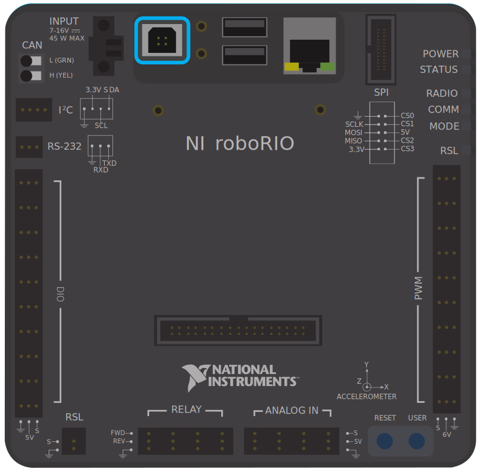

# What is RoboRio?

RoboRio is **your computer** for the robot.
Essentially all your code is ran on the RoboRio, and all the electrical components and CAN bus is connected to the RoboRio

Here is what a RoboRio 1.0 look like

