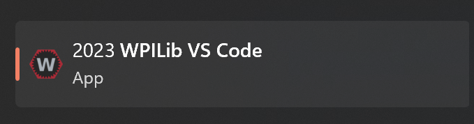
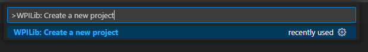
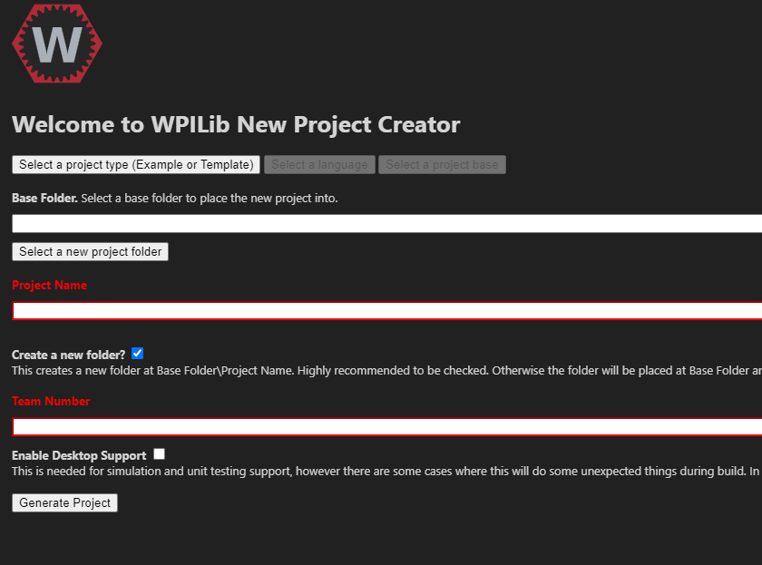

# Robot Code Setup
This page will help you create a robot code template

## WPILib VSCode
During your installation of WPILib, you should have downloaded a version of VSCode called "WPILib VS Code".
Take a look at the [WPILib installation guide](/docs/system-setup/wpilib_setup) on how to download WPILib.

1. Open "WPILib VS Code"

    
2. Once the app has loaded, Click `Ctrl + Shift + P`
3. Type "WPILib: Create a new project" and select the option `WPILib: Create a new project`

   
4. You should see a project setup up screen 

   
5. Select "Select a project type"
6. You can either choose "Template" or "Example"
   * **Example**
      * If you chose Example, select any project that suits your needs
   * **Template**
      * If you chose Template, select any of the template that suits your needs
7. Then select "Java" as your language
8. For Base Folder, select your project directory you want to store your project. 
9. Under "Project Name" enter any project name.
10. Under "Team Number" enter your team number. Ours is 4384. 
11. Click "Generate Project" and you have now created a base codebase for our robot.

   

## Coding
To edit your robot project, we will use a code editor. You can either use [IntelliJ](https://www.jetbrains.com/idea/) <b>(Team Preference)</b> or [VSCode](https://code.visualstudio.com/) **(FRC Preference)**. For our team we will use IntelliJ.

* IntelliJ
  * Open IntelliJ
  * Select "Projects" on the left panel
  * Click on "New Project" on the top-right of the widget
  * Go to your project folder path
  * Then click "Open"
  * This should open up the editor and allow you to edit the project

:::note

If you get a message about project trust, just click "Trust Project"

:::

* VSCode
  * Open VSCode
  * Top left click on "File"
  * Select "Open Folder"
  * Go to your project folder path
  * Then Click "Open"
  * This should allow you to edit the project