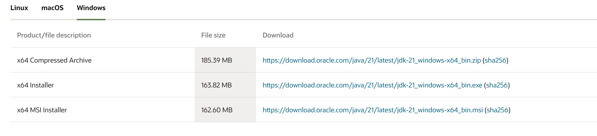
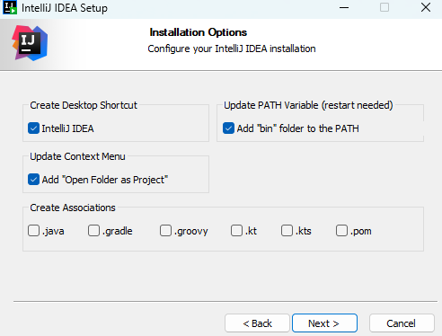

# Start Here
For our team we will be using Java to program our robot. 
This page will help you setup your computer to be able to program in Java.

**Requirements**
1. Make sure you have [WPILib](/docs/system-setup/wpilib_setup) setup on your computer.

## JDK Installation
To run any Java code, you need a **JVM (Java Virtual Machine) compiler**. This allows 
you to convert your high-level code into machine code (Binary). 
To get the JVM, we need to download a version of **JDK (Java Development Kit)**

1. Find a OpenJDK build above JDK 8
   * **Recommended**
     * Visit [Oracle Java Builds](https://www.oracle.com/java/technologies/downloads/) and find the latest version of a JDK build
   * **Legacy**
     * Visit [Oracle Java Archive Builds](https://www.oracle.com/java/technologies/downloads/archive/) and find the version of a JDK build that is required for your project. 
2. Scroll down to OS builds and select your OS
  
   
3. Click on one of the download link
* **Recommended: x64 Installer**
  
   
4. Locate your downloaded exe file in File Explorer, and double click to **install**
5. Follow the Installer prompts
6. Once your at the end of the installation, click "Close"
7. You are done installing JDK! 🎉

## IDE
For FRC it is recommended to use Visual Studio Code (VSCode), but for our team we will primarily use IntelliJ. 
IntelliJ is a powerful Java IDE that allows to you pretty much write any java applications but has some special that has been useful for our team, but it doesn't matter if you use VSCode or IntelliJ. 
In this tutorial we will cover VSCode and IntellJ installation.

### VSCode
1. Go to [code.visualstudio.com](https://code.visualstudio.com/)
2. Click Download
3. Run through the installer
4. Once done with the installation, you should have VSCode installed! 🎉

### IntelliJ
1. There are 2 versions of IntelliJ you can download.
   * Community Version: This version is free and Open-Sourced
     * **Free**
     * [Download Link](https://www.jetbrains.com/idea/download/?section=windows) (SCROLL DOWN FOR THE DOWNLOAD)
   * Ultimate Version: This is a paid version of IntelliJ with extra features.
     * **You get a 30-Day Free Trial**
     * You can use **Student License** to get it for **Free**
     * [Download Link](https://www.jetbrains.com/idea/download/?section=windows)
   * **NOTE: The version of IntelliJ you use doesn't matter, you can either choose Community Version or Ultimate Version.**

2. Select your OS, and click "Download"
3. Once downloaded, locate the file in your File Explorer
4. Double-click the installation file
5. Run through the installation prompts
   * When your arrive at this prompt, select these boxes. Then click "Next" 
   
   
4. Once done with the installation, you should have IntelliJ installed! 🎉

## Java Tutorial
If you're new to Java, take a look at this Java tutorial by [Programming with Mosh](https://www.youtube.com/c/programmingwithmosh)

<iframe width="560" height="315" src="https://www.youtube.com/embed/eIrMbAQSU34?si=X1K0g71ky5uNo2HW" title="YouTube video player" frameborder="0" allow="accelerometer; autoplay; clipboard-write; encrypted-media; gyroscope; picture-in-picture; web-share" allowfullscreen></iframe>
