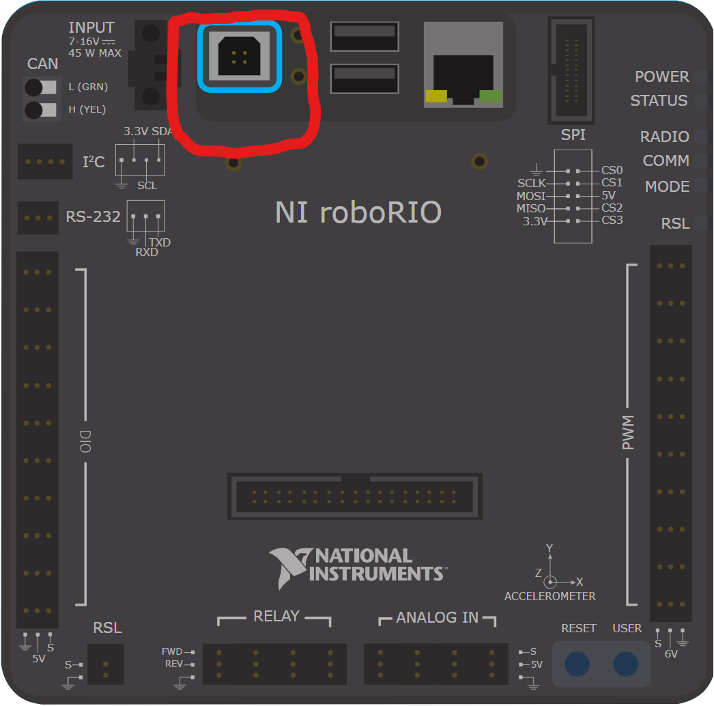
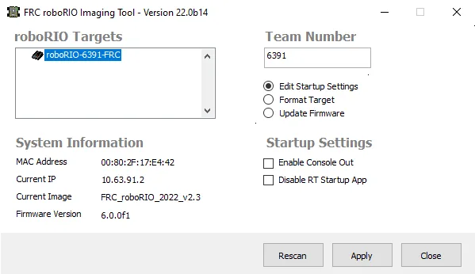
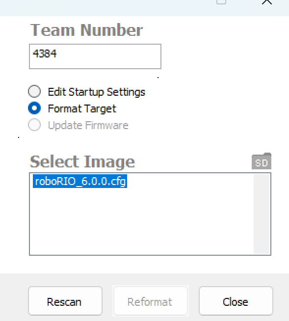
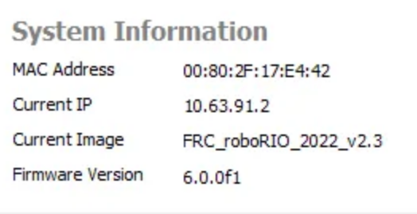

# Imaging RoboRio 1.0

This page will teach you how to **Program/Config your radio**

Learn more about [Radio](/docs/QA/roborio1)

:::note

This is for RoboRio 1.0, if you have RoboRio 2.0 refer [here](https://docs.wpilib.org/en/stable/docs/zero-to-robot/step-3/roborio2-imaging.html)

We will be using USB protocol as it is the best way to image your RoboRio.

**IMPORTANT: Make sure you have [USB A to USB B 2.0](https://www.andymark.com/products/6-foot-usb-a-to-usb-b-2-0-cable)**

:::

## Connection
1. Have your [USB A to USB B 2.0](https://www.andymark.com/products/6-foot-usb-a-to-usb-b-2-0-cable) on hand.
2. Locate your RoboRio 1.0 and find the USB 2.0 Port as shown in the picture.
3. Connect the USB B 2.0 head to the connector on your RoboRio.
   

## Imaging Tool
1. Connect your USB A head to your computer
2. Open `roboRIO Imaging Tool` app

   
3. Let the application scan for the RoboRio.

:::note

If in the "roboRIO Targets" doesn't show your RoboRio click the `Recan` Button

:::

4. Select your RoboRio from the roboRIO Targets
5. Change the "Team Number" section to your Team Number (Our team number is **4384**)
6. Select "Format Target"
7. Select your Latest Image from the Select Image section
   
8. Click "Reformat"

Once the reformatting is done, your RoboRIO is now reformatted to your new image! 🎉

:::tip

Double check if the reformatting worked by looking at `System Information > Current Image`.
It should show your **latest image** that is on your RoboRio.

:::