# Installation
Before we are able to program our robot, we need to install a software called Game Tools

The FRC Game Tools has packages for
* LabVIEW
* FRC Drive Station
* FRC roboRIO Image Tool and Images

Requirements
* Windows 10+

---

## Uninstall Previous Versions!
Uninstall previous version of the NI Software and NI Packager 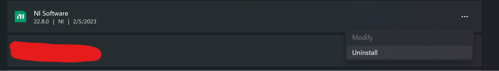 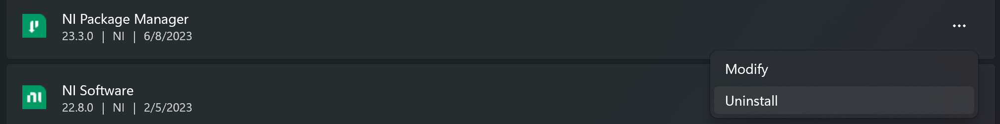

## Navigate to NI
[**NI Website**](https://www.ni.com/en/support/downloads/drivers/download.frc-game-tools.html#479842)
## Select the latest version
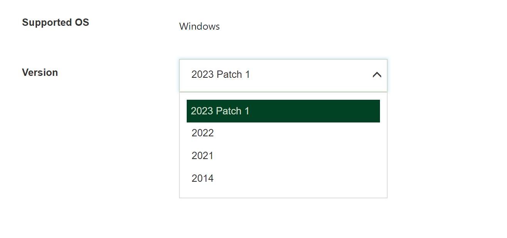
## Select your download option
For the purpose of this tutorial we will use the **Online** installation 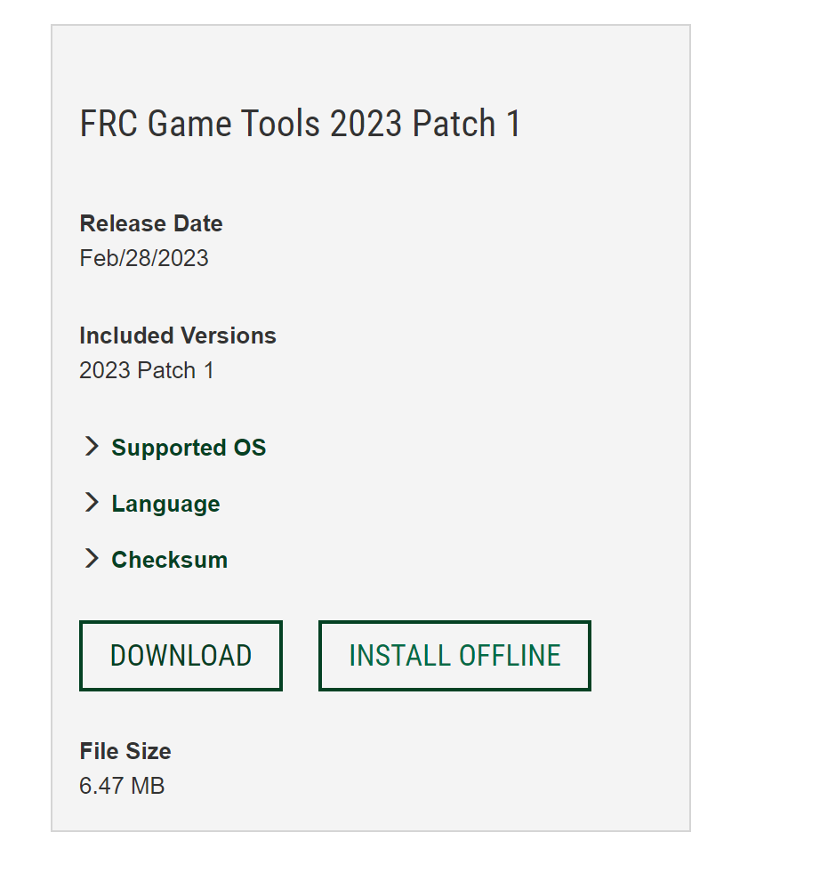
## Extraction
Navigate to the **NI Installer** in your file explorer, and <u>**double click to start the extraction**</u>

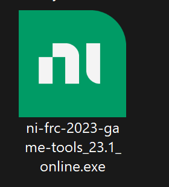

## Licence Agreement
Read the license agreement of NI and .NET 4.8.

Then click **"I accept the above 2 license agreements"**
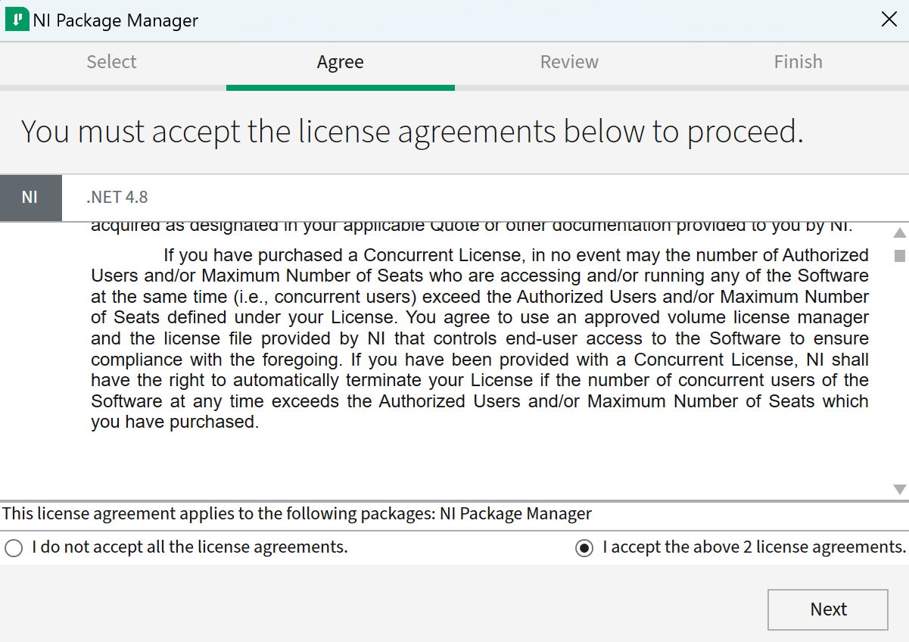

## NI Review
Review the packages that are being installed, then click **Next**
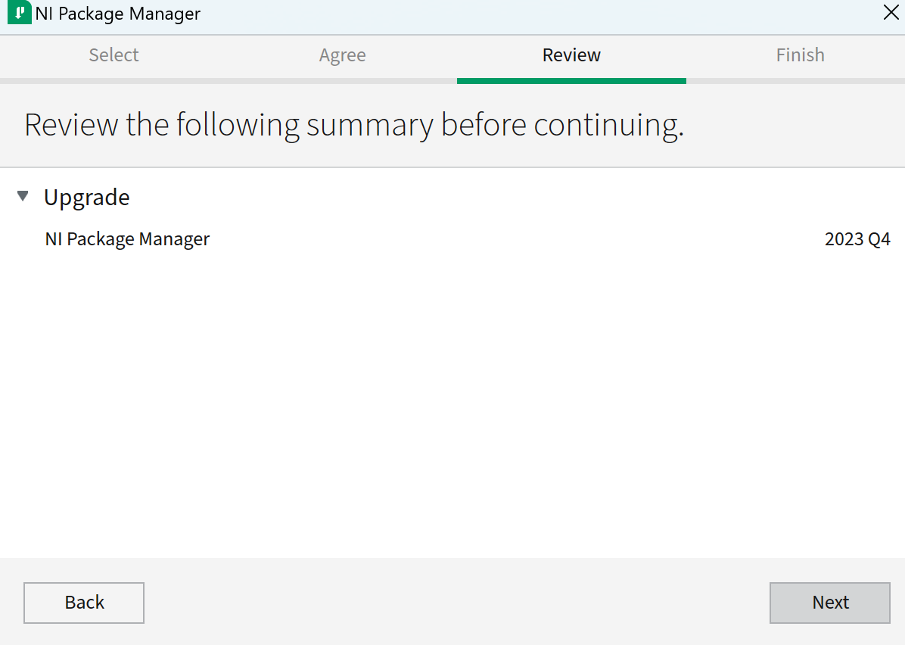

Let the NI Installer finish installing
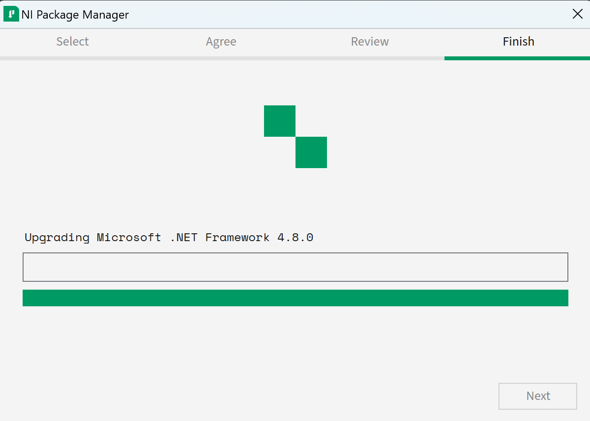

## NI Account
If you are prompted with a login page, login to your NI account if you already have one. If you do not, please clicked the **Create Account** and follow the instructions in account creation
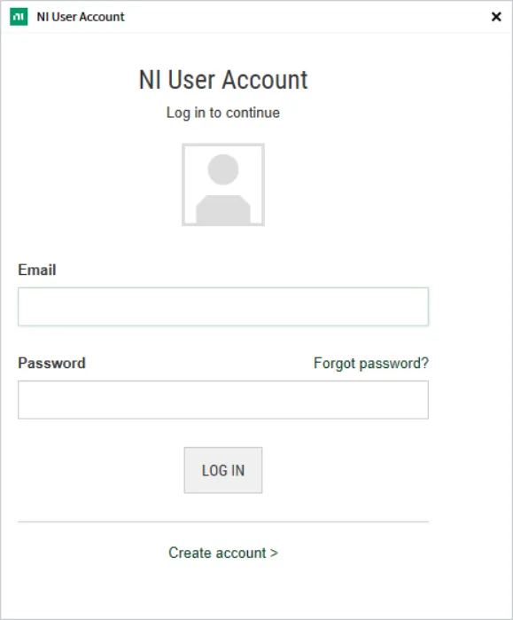

**NOTE: If you're prompted to reboot your computer, please do so!**

## Downloaded Applications
Once you have finished rebooting your computer, you should have these applications installed on your computer
1. FRC Drive Station   
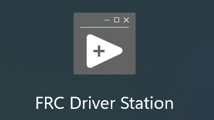
2. roboRIO Imaging Tool  
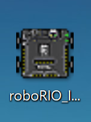
