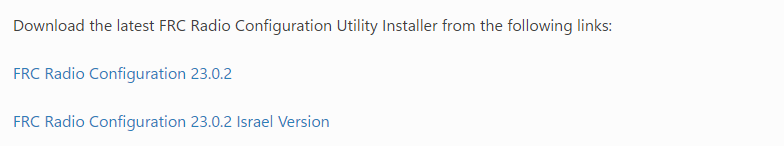
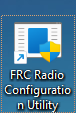
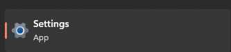
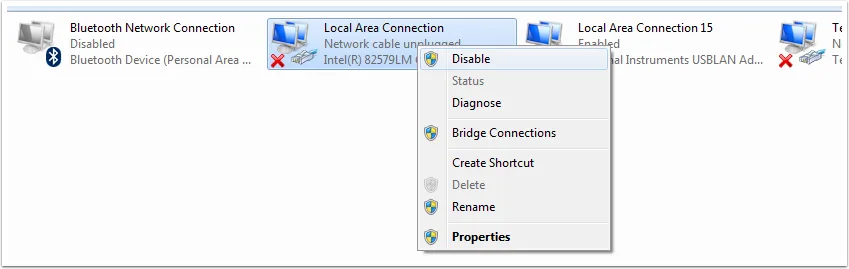
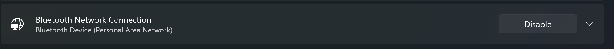
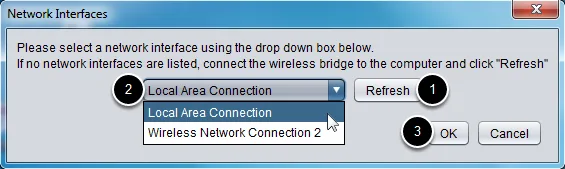

# Radio Configuration

This page will teach you how to **Program/Config your radio**

Learn more about [Radio](/docs/QA/radio)

## Application
1. Download the Configuration Application from [here](https://docs.wpilib.org/en/stable/docs/zero-to-robot/step-3/radio-programming.html#prerequisites).

   

2. Extract the Zip file
3. Click on the extracted folder
4. Select the radio configuration EXE file
5. Run through the installer
6. You are done installing the FRC Radio Configuration app

   

## Disable Network Adapters

:::note 

When your configuring your Radio, you should disable all your computer Network Adaptors.
:::

1. Go to your Settings App

   
2. Select "Network and Internet"
3. Here we will disable all the available Network Adapters different depending on your OS
   * Windows 10
     * Select "Change adapter options"
     * On your left side of your Control Panel, select "Change adapter settings"
     * Right click on each of the adapters > click `Disable`
        
     
   * Windows 11
     * Select "Advanced network Settings"
     * For all the Network Adapters you see, click `Disable`
       

## Configuration
We will start to configure the radio.

1. Make sure your radio has power
   * PoE
     * If your radio is using PoE for the robot, just disconnect the 
     Ethernet cable that is connected your RoboRio or your Radio Module.
     * Turn on your robot.
   * Power Port
     * If your radio is using the Power Port to power the Radio, just make sure the Robot is turned on.
2. Connect Ethernet cable from your **Computer to Radio via Port 2 (Ethernet Port 1)**
   * If your using PoE,
   just connect the Ethernet cable to the same port that you disconnect the RoboRio or the Radio Module Ethernet cable. 
   * **NOTE: MAKE SURE IT IS PORT 2 ON THE RADIO. View the port reference [here](/docs/QA/radio#ports)**
3. Open **FRC Radio Configuration App**
4. If all steps are followed precisly, you should have an option called "Local Area Connection".  

:::note

If "Local Area Connection" doesn't show up
* Click "**Refresh**" and locate the "Local Area Connection".
* Double check [this](/docs/system-setup/radio_config#disable-network-adapters)

:::

   

5. Click "Ok"
6. Change the "Team Number" to your team number (our is 4384)
   * Optional: Add a robot name (useful to differentiate routers)
7. Click "Configure"

:::tip

If you configuration process throws an error, follow these [Troubleshooting steps](https://docs.wpilib.org/en/stable/docs/zero-to-robot/step-3/radio-programming.html#troubleshooting). 

:::

## WI-FI Connection
1. Once the Radio is configured, Power Cycle the robot. 
   * In other words, turn off and on the robot.
2. Wait for the robot systems to initialize and the Radio to startup
   * On the radio wait for an Orange light
3. Open your computer's Wi-Fi networks to show the "Available Networks"
4. Find your Radio from the network list. Here is an example from [Team 6141](https://www.youtube.com/watch?v=QexBvqz_Ep4)
   
    
    
:::note

Your radio will show up as (TEAM_NUMBER+ROBOT_NAME). I.e "4384_BB1",
the "4384" is the team number and "_BB1" is the Robot name.

:::

