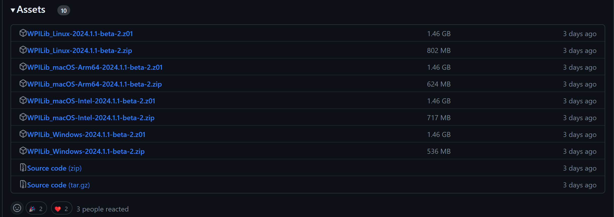
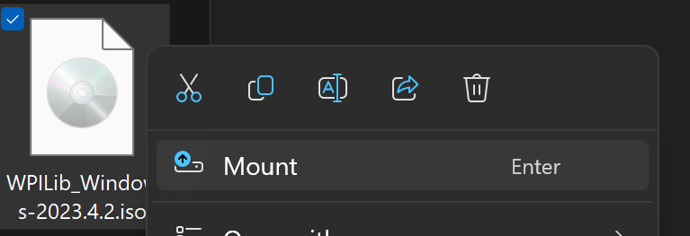
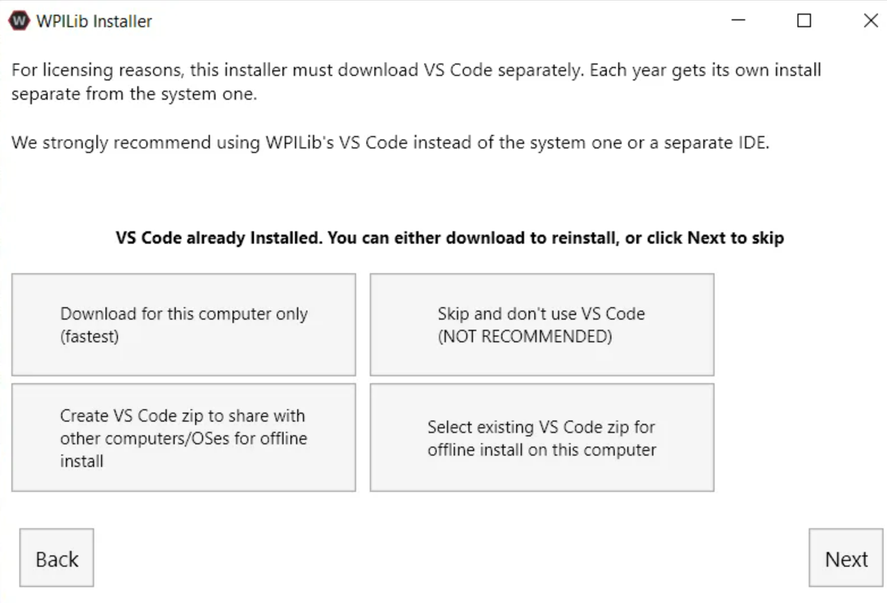

# WPILib Setup
WPILib is a software library for all FRC Team. 
This library allows us to interact with different electrical components. 
It has a lot of classes that allows you to interact with the FRC Drive Station, electrical components, SmartDashboard, and more.

[Learn more](https://docs.wpilib.org/en/stable/docs/software/what-is-wpilib.html)

**This is essential for FRC Programming.**

### Requirements 
* Windows 10+, 64x bit only!
* Refer to [FRC WPILib Instruction](https://docs.wpilib.org/en/stable/docs/zero-to-robot/step-2/wpilib-setup.html) for more details.

:::note

For this tutorial we will be using Windows 10+.

:::

## Download
1. Navigate to WPILib's Github [releases page](https://github.com/wpilibsuite/allwpilib/releases)
2. Find the latest version of WPILib release
3. Scroll down to Assets, then select the software that corresponds your OS 

## Extraction
1. Locate your Download file in your File Explorer
2. Right click and select `Mount`

:::note

If you do not have `Mount` option, use [7-Zip](https://www.7-zip.org/) and extract the file through it.
:::

3. Run through the Installer prompts
   * Choose `Everything`
   * Chose `Install for this User` or `Install for all Users`
     * For `Install for this User` install the WPILib to your current signed in account
     * For `Install for all Users` install WPILib to all the users in your computer 

## VSCode Install Prompt
When the installer prompts you to download the WPILib's own VSCode version, make sure you do download them.

**Recommended: Select the `Downalod for this Computer only` option**

## Conclusion
Once WPILib is done installing, click `Finish`. You have finished downloading WPILib to your computer! 🎉